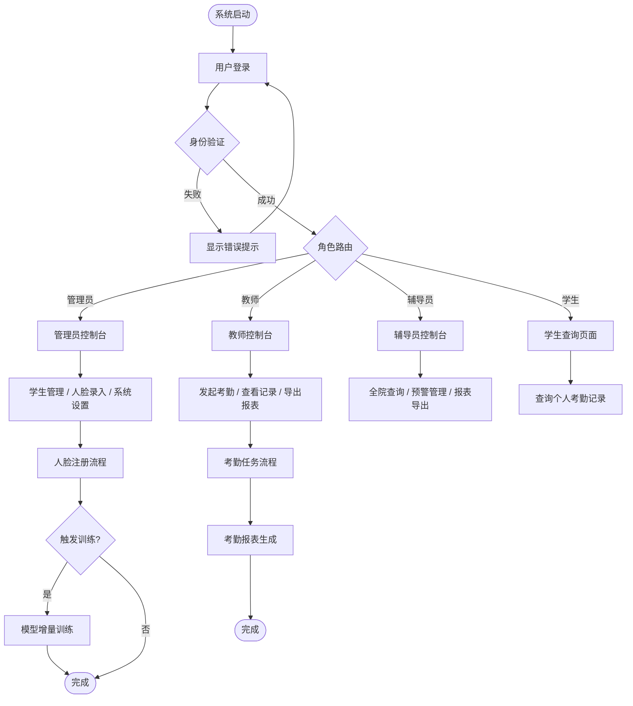
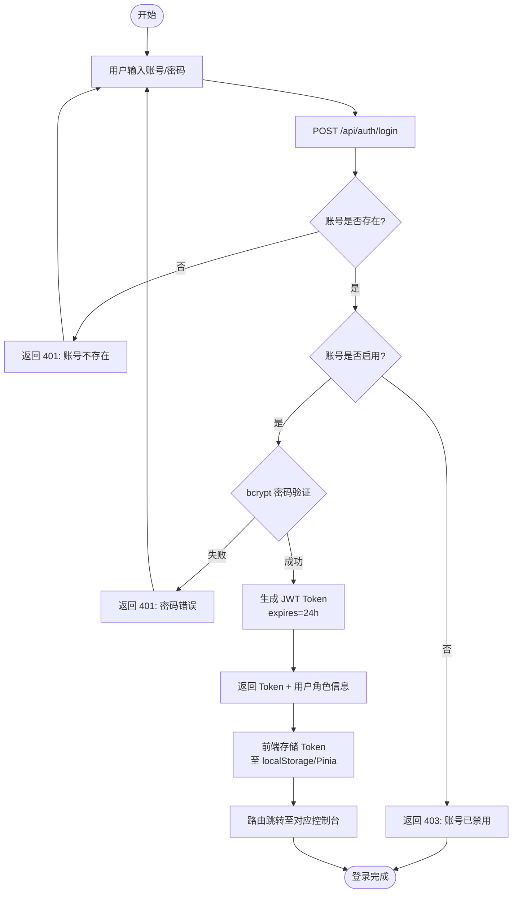
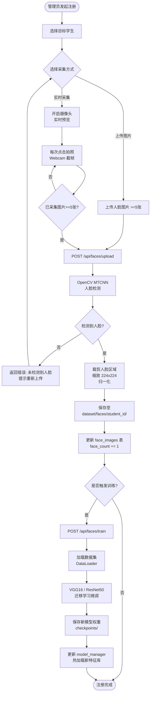
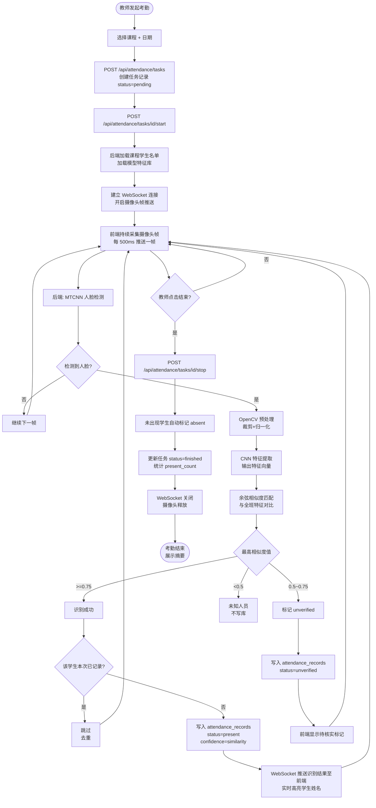
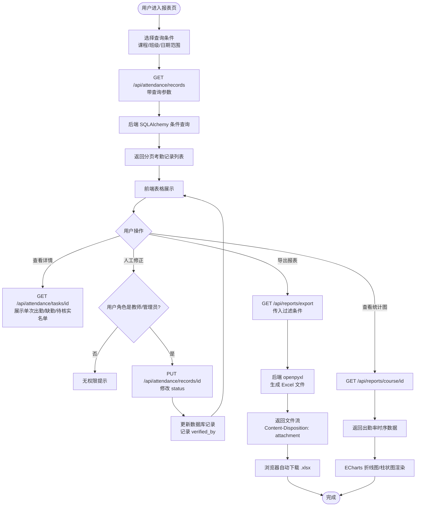
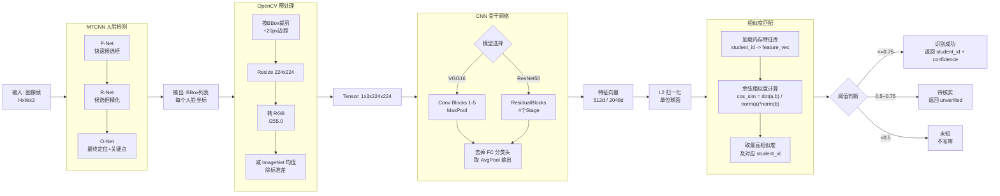
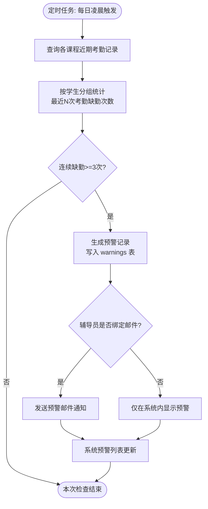

# 基于CNN的校园课堂智能考勤系统 — 流程图设计

**版本**：v1.0  
**日期**：2026-04-16  
**图表格式**：Mermaid（可在 VS Code / GitHub / Typora 渲染）

---

## 1. 系统整体业务流程

---

## 2. 用户登录与认证流程

---

## 3. 学生人脸注册流程

---

## 4. 考勤任务核心流程（实时摄像头）

---

## 5. 考勤记录查询与报表导出流程

---

## 6. CNN 模型推理详细流程

---

## 7. 异常考勤预警流程

---

*文档版本：v1.0 | 最后更新：2026-04-16*
