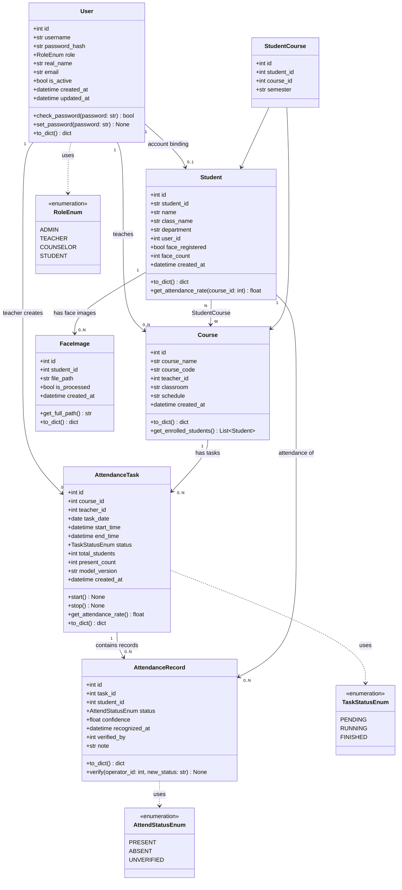
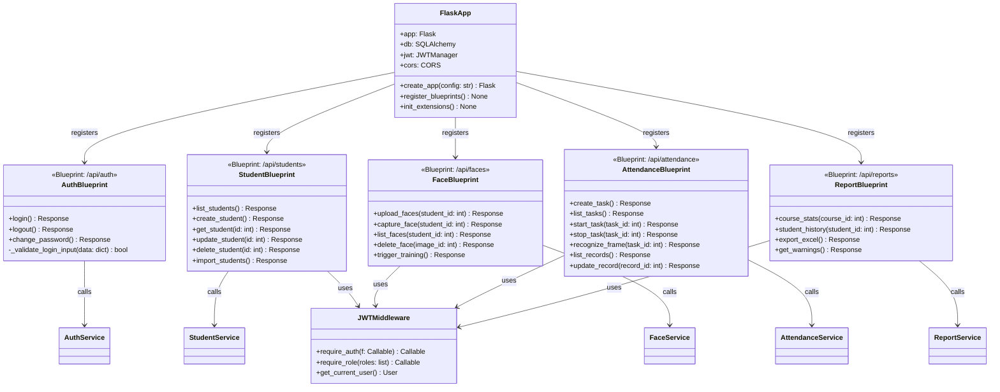
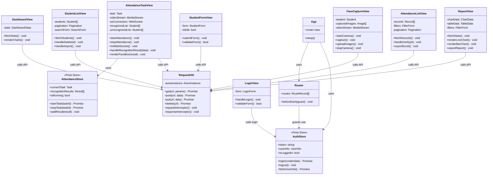

# 基于CNN的校园课堂智能考勤系统 — 类图设计

**版本**：v1.0  
**日期**：2026-04-16  
**图表格式**：Mermaid classDiagram

---

## 1. 后端数据模型类图（SQLAlchemy ORM）

---

## 2. 后端服务层类图

```mermaid
classDiagram
    class AuthService {
        +login(username: str, password: str) dict
        +logout(user_id: int) None
        +change_password(user_id: int, old_pw: str, new_pw: str) bool
        +generate_token(user: User) str
        +verify_token(token: str) User
    }

    class StudentService {
        +get_students(page: int, per_page: int, filters: dict) Pagination
        +get_student_by_id(student_id: int) Student
        +create_student(data: dict) Student
        +update_student(student_id: int, data: dict) Student
        +delete_student(student_id: int) None
        +import_from_excel(file_path: str) tuple~int, int~
        +get_face_status_summary() dict
    }

    class AttendanceService {
        +create_task(course_id: int, teacher_id: int, task_date: date) AttendanceTask
        +start_task(task_id: int) None
        +stop_task(task_id: int) None
        +process_frame(task_id: int, image_data: bytes) list~dict~
        +get_records(filters: dict, page: int, per_page: int) Pagination
        +update_record(record_id: int, status: str, operator_id: int) AttendanceRecord
        +mark_absent_students(task_id: int) int
    }

    class ReportService {
        +get_course_stats(course_id: int, date_range: tuple) dict
        +get_student_history(student_id: int) list~dict~
        +export_excel(filters: dict) bytes
        +get_warnings() list~dict~
        +check_and_generate_warnings() None
    }

    class FaceService {
        +upload_face_images(student_id: int, files: list) list~FaceImage~
        +capture_face(student_id: int, image_data: bytes) FaceImage
        +preprocess_image(file_path: str) str
        +trigger_training(model_type: str) bool
        +get_face_images(student_id: int) list~FaceImage~
        +delete_face_image(image_id: int) None
    }

    AuthService --> User
    StudentService --> Student
    AttendanceService --> AttendanceTask
    AttendanceService --> AttendanceRecord
    ReportService --> AttendanceRecord
    FaceService --> FaceImage
    FaceService --> Student
```

---

## 3. AI 模块类图

```mermaid
classDiagram
    class FaceDetector {
        -mtcnn: MTCNN
        -min_face_size: int
        -thresholds: list~float~
        +__init__(min_face_size: int)
        +detect(image: ndarray) list~BoundingBox~
        +detect_batch(images: list~ndarray~) list~list~BoundingBox~~
    }

    class BoundingBox {
        +x1: int
        +y1: int
        +x2: int
        +y2: int
        +confidence: float
        +landmarks: ndarray
        +to_crop_coords(padding: int) tuple
    }

    class Preprocessor {
        -target_size: tuple
        -mean: list~float~
        -std: list~float~
        +__init__(target_size: tuple)
        +crop_face(image: ndarray, bbox: BoundingBox, padding: int) ndarray
        +resize(image: ndarray) ndarray
        +normalize(image: ndarray) ndarray
        +to_tensor(image: ndarray) Tensor
        +preprocess(image: ndarray, bbox: BoundingBox) Tensor
    }

    class FaceRecognizer {
        -model: Module
        -model_type: str
        -device: device
        +__init__(model_type: str, weights_path: str)
        +extract_features(face_tensor: Tensor) ndarray
        +extract_features_batch(tensors: list~Tensor~) ndarray
        -_build_model(model_type: str) Module
        -_remove_classifier(model: Module) Module
    }

    class VGG16Backbone {
        <<extends Module>>
        -features: Sequential
        -avgpool: AdaptiveAvgPool2d
        -embedding: Linear
        +forward(x: Tensor) Tensor
    }

    class ResNet50Backbone {
        <<extends Module>>
        -conv1~layer4: Sequential
        -avgpool: AdaptiveAvgPool2d
        -embedding: Linear
        +forward(x: Tensor) Tensor
    }

    class FeatureDatabase {
        -db: dict~str, ndarray~
        -student_ids: list~str~
        -feature_matrix: ndarray
        +load_from_file(path: str) None
        +save_to_file(path: str) None
        +add_student(student_id: str, features: list~ndarray~) None
        +remove_student(student_id: str) None
        +query(query_vec: ndarray, top_k: int) list~tuple~str, float~~
        +rebuild_matrix() None
    }

    class ModelManager {
        -recognizer: FaceRecognizer
        -detector: FaceDetector
        -preprocessor: Preprocessor
        -feature_db: FeatureDatabase
        -current_model_version: str
        -similarity_threshold: float
        -unverified_threshold: float
        +__init__(config: dict)
        +recognize_faces(image: ndarray) list~RecognitionResult~
        +load_model(model_type: str, weights_path: str) None
        +reload_feature_db() None
        +get_model_info() dict
    }

    class RecognitionResult {
        +student_id: str
        +student_name: str
        +confidence: float
        +status: str
        +bbox: BoundingBox
        +to_dict() dict
    }

    class ModelTrainer {
        -model_type: str
        -dataset_path: str
        -learning_rate: float
        -batch_size: int
        -epochs: int
        -device: device
        +__init__(model_type: str, config: dict)
        +prepare_dataset() tuple~DataLoader, DataLoader~
        +train() TrainingResult
        +evaluate(dataloader: DataLoader) dict
        +save_checkpoint(path: str) None
        +extract_all_features(dataloader: DataLoader) dict
    }

    class TrainingResult {
        +model_type: str
        +best_accuracy: float
        +best_epoch: int
        +train_history: list~dict~
        +val_history: list~dict~
        +weights_path: str
        +to_dict() dict
    }

    %% Relationships
    ModelManager --> FaceDetector : uses
    ModelManager --> Preprocessor : uses
    ModelManager --> FaceRecognizer : uses
    ModelManager --> FeatureDatabase : uses
    ModelManager ..> RecognitionResult : returns

    FaceDetector ..> BoundingBox : returns
    Preprocessor --> BoundingBox : takes input
    FaceRecognizer --> VGG16Backbone : creates (if vgg16)
    FaceRecognizer --> ResNet50Backbone : creates (if resnet50)

    ModelTrainer ..> TrainingResult : returns
    ModelTrainer --> FaceRecognizer : evaluates
    ModelTrainer --> FeatureDatabase : builds
```

---

## 4. Flask API 层类图（Blueprint 结构）

---

## 5. 前端 Vue 组件关系图

---

*文档版本：v1.0 | 最后更新：2026-04-16*
